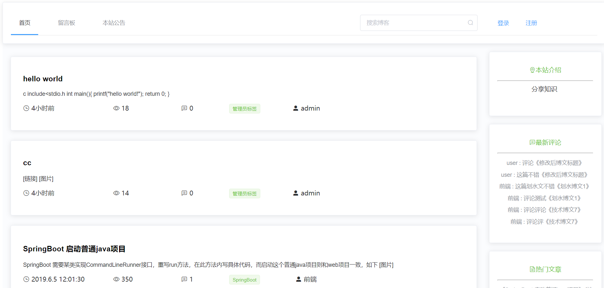
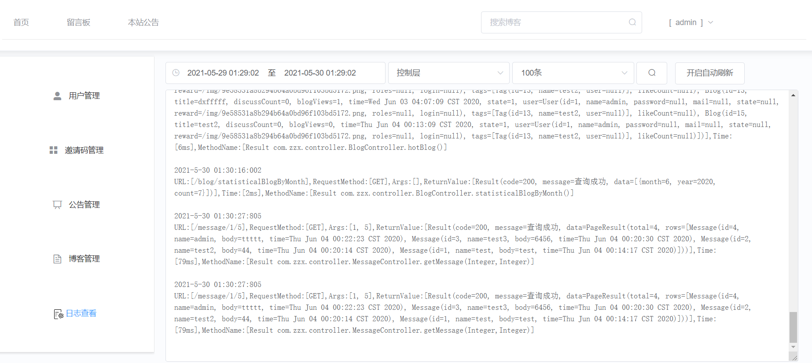
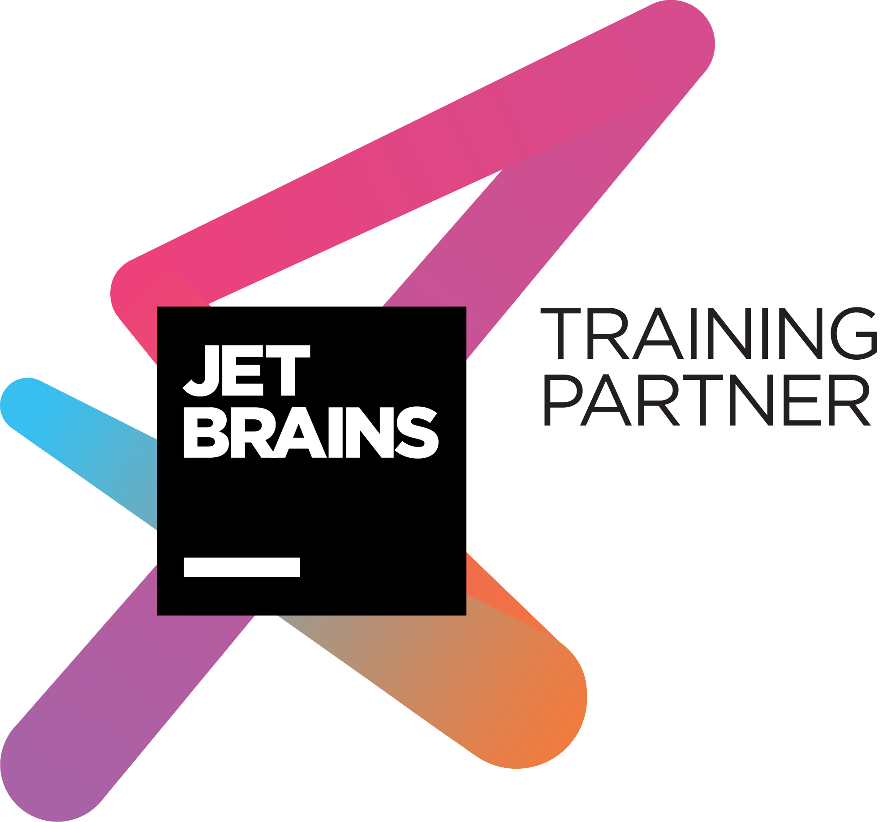

## Blog

#### 前端

* Vue(Vuex+Vue router)
* Element-UI

#### 后端

* SpringBoot
* MyBatis
* Spring security
* JWT
* Mongo
* Redis
* RabbitMQ
* Swagger-UI
* [ip2region](https://github.com/lionsoul2014/ip2region)

#### 项目目录

* blog-springboot              后端工程 [后端文档](blog-springboot/README.md)
* blog-vue                           前端工程 [前端文档](blog-vue/README.md)
* img                                    文档相关图片
* other                                 其他文档
  * prototype.md		   原型文档
  * 博客缓存.png            redis博客缓存说明
  * 后端功能说明.png     后端功能说明
* conf                                   已配置的项目压缩文件
  * nginx.conf                 nginx配置文件，已配置好
* blog.sql                             mysql数据库结构

#### 预览

* 主页
* 博客 
* 后台 
* 实时日志 

#### docker 部署教程
[Docker 部署本站 详细全过程 附代码](https://blog.22xcode.com/post/12)

##### Tips

1. 水平所限，部分代码可能有坑
2. 管理员账号 admin 密码 1

... 

有毕设需求可以联系`1970432392@qq.com`

[JetBrains Open Source License](https://www.jetbrains.com/?from=Blog)

